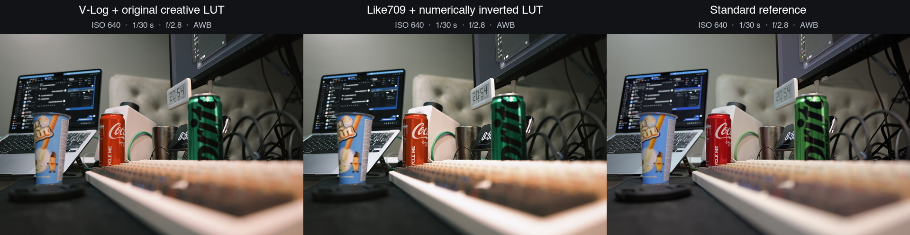
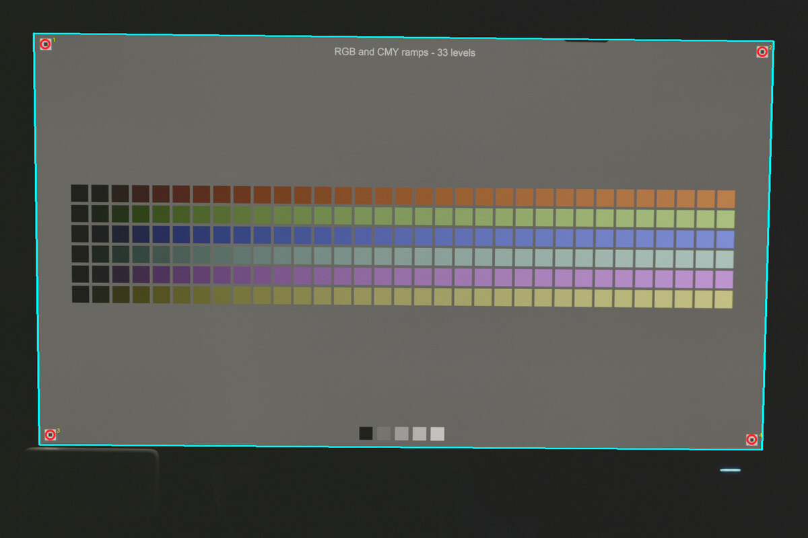
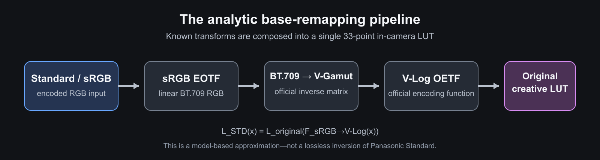
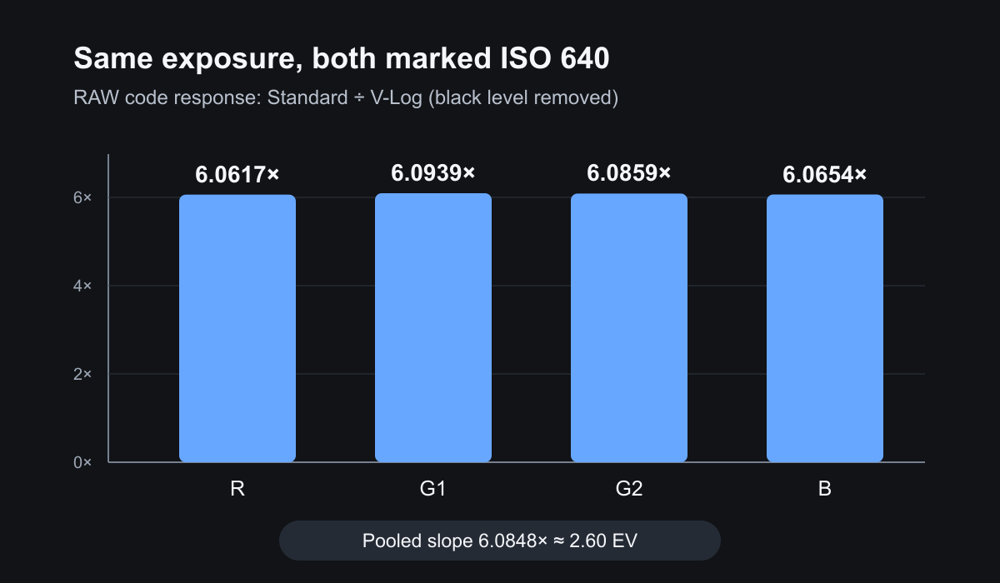
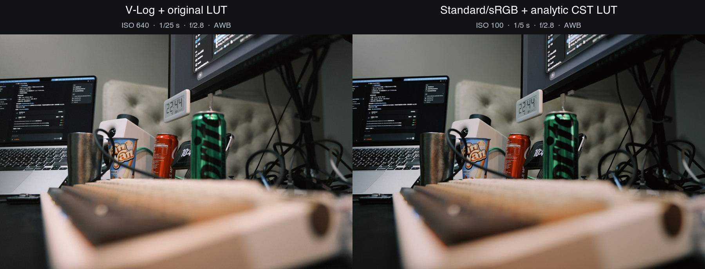

# 我为什么想把 V-Log LUT 转成 Standard：一次关于 LUMIX LUT、ISO 与色彩科学的业余探索

> 记录于 2026 年 7 月。本文不是色彩科学教程，而是一名普通 LUMIX 用户从一个拍照问题出发，边查资料、边写代码、边实拍验证的过程。

先把最重要的免责声明放在前面：**我不是色彩科学专家，也没有相机厂商的内部资料。**
我只是喜欢折腾相机、LUT 和 RAW 的业余爱好者。文中的公式来自 Panasonic 公布的技术资料，
数值来自我手上的 LUMIX S9 和这次拍摄的样本；其中既有比较扎实的结论，也有仍需更多机型和
严格实验验证的部分。我会尽量把两者分开写，不把一个“看起来合理”的猜测包装成定论。

这次探索最后变成了一个开源项目：
[t0saki/lumix-lut-converter](https://github.com/t0saki/lumix-lut-converter)。项目使用 Python、
`uv`、`numpy.float64` 和四面体插值，目标不是“破解松下色彩”，而是把已公开、可解释的部分
做成可复现的工具。

这个idea正当GPT-5.6推出，因此想作为我个人对新模型的测试，代码部分和初稿由GPT-5.6 Sol写作，经过我和Fable 5的修改和Gemini 3.1 Pro的润色。

## 一切从 ISO 640 开始

LUMIX Real Time LUT 很好玩：把 `.cube` 或 `.vlt` 导入相机，就可以在拍摄时直接得到带有
风格的 JPEG。问题是，很多现成 LUT 以 **V-Log / V-Gamut** 为输入；当 LUT 的 Base Photo
Style 是 V-Log 时，S9 的照片模式最低 ISO 会被限制在 640，而 Standard 可以从 ISO 100
开始。这个范围可以在 [S9 Complete Guide 的 ISO 说明](https://help.na.panasonic.com/wp-content/uploads/2024/06/DCS9_DVQP3138ZA_ENG.pdf#page=294)
中看到。

对视频而言，V-Log 的工作方式很自然；但我主要想用 Real Time LUT 拍照。室内、慢门或大光圈
场景里，最低 ISO 640 不只是菜单数字不好看：如果我按相同的直出亮度曝光，V-Log 工作流往往
会使用更短的快门、让传感器接收到更少的光。这样做为高光留下了空间，却会让中间调和暗部 RAW
的信噪比下降。

于是最初的问题很朴素：

> 能不能把一张以 V-Log 为输入的创意 LUT，转换成以 Standard 为输入的 LUT，让相机可以在
> ISO 100 下得到尽量相近的直出效果？

我一开始甚至把它叫作“无损转换”。后来发现这个词太满了。更准确的描述应该是：
**把 LUT 的输入基底重新映射（base remapping）**。已知的颜色变换可以高精度合成，但已经
发生的裁切、色域压缩和相机内部未公开的 tone mapping，不可能靠另一张 LUT 凭空恢复。

## 第一阶段：从官方 Like709 LUT 反推

最先想到的参照物是 Panasonic 官方的 `VLog_to_V709_forV35`。它定义了一条从
V-Log/V-Gamut 到 V709 的技术映射。如果把它记作 `T`，原创意 LUT 记作 `L`，直觉上可以
先数值求出 `T⁻¹`，再合成：

```text
Like709 输入 → T⁻¹ → V-Log/V-Gamut → 原创意 LUT L
```

也就是：

```text
L_Like709(x) = L(T⁻¹(x))
```

我为此写了 KD-tree 初值、有界阻尼 Gauss–Newton、四面体插值和 Rec.709/CIELAB 误差检查。
从数值计算角度看，这条路线确实能跑起来。第一轮实拍里，原生 V-Log LUT 与逆向后的 Like709
版本已经很接近。



*图 1：同为 ISO 640、1/30 s、f/2.8。左为 V-Log + 原创意 LUT，中间为 Like709 + 数值逆向
LUT，右边是 Standard 参考。三张使用了 AWB，因此只能作为视觉观察，不能拿来做严格色差结论。*

这一步让我确认了“把技术变换预先合成进创意 LUT”在工程上可行，但它也暴露出新的问题：

- Like709 Photo Style 不等于 Standard，我真正想要的是 Standard 的 ISO 100 工作范围；
- 官方 V709 LUT 带有 legal/full range 的解释问题；
- 3D LUT 中出现裁切或多对一映射后，逆函数并不处处唯一；
- 即使数值反演很精确，也不能证明相机内部 Like709 与这张 VariCam 技术 LUT 完全相同。

所以 Like709 方案被保留为交叉验证工具，却没有成为最后的推荐答案。

## 第二阶段：既然 Standard 没公开，那就把它“拍出来”

接下来我走向了一个更麻烦、也更直觉的方案：在屏幕上显示大量已知色块，分别用 V-Log、
Like709 和 Standard 拍摄，再从 JPEG 中学习 `Standard → V-Log` 的映射。

这条路最开始并不顺利。第一组照片用了自动白平衡，不同画面的白平衡会跟着屏幕内容变化；
如果直接拿来拟合，模型学到的就不只是 Photo Style 差异，还包括相机每一张照片的白平衡决定。
此外，如果为了“避免 JPG 丢细节”而给每一张图单独改变曝光，曝光变化也会一起进入模型。

为了把实验做得像样一点，我用 Python 生成了一组 4K SDR 校准画面，包括：

- 多档灰阶和单通道阶梯；
- RGB/CMY ramp；
- 规则的 9×9×9 RGB cube；
- 若干自然风景图作为验证，而不是训练主体；
- 四角机器可读定位标记，用于自动做透视校正和色块采样。

过程中还有很生活化的小插曲：浏览器直接打开本地 `viewer.html` 时遇到了 `file:` 安全源限制，
页面左上角的说明文字又挡住了定位框。解决本地服务和版面问题后，第二组拍摄固定在 5500 K、
手动对焦；同一色卡的三种 Photo Style 保持同样曝光，只有不同色卡页之间按需要调整曝光。



*图 2：程序找到四个角标后计算透视变换，再按 manifest 中的坐标采样色块。第二组 39/39 张
全部成功定位，共得到 3,552 个配对样本。*

经验拟合的结果其实不差。对未裁切样本，训练集平均最大通道误差约为 `0.52/255`，P95 为
`1.19/255`；独立灰阶验证的平均误差约为 `2.80/255`，P95 为 `8.28/255`。

但这里有一个很重要的教训：**低拟合误差不等于模型学到了正确的色彩科学。** 它可能只是很
准确地记住了这一台相机、这一块 QD-OLED 屏幕、5500 K 白平衡、当时的曝光、JPEG tone curve
以及两个 Photo Style 的增益差异。

换句话说，这个经验模型很适合研究“相机实际做了什么”，却不一定适合被宣布为所有场景、所有
机型都通用的 Standard 逆向 LUT。

## 转折点：别急着拟合，Panasonic 已经公开了关键公式

研究进行到这里时，[@Jackchou00](https://github.com/Jackchou00) 提醒我：Panasonic 已经
公开了 V-Log 的 encoding function 和 V-Gamut 定义。与其继续把所有变量塞给黑箱拟合，不如
先用这些公开资料建立标准的 colour space transform；实拍应该用来验证未公开的残差，而不是
替代已经公开的数学模型。

这句话直接改变了项目方向，也是整个探索中最关键的一次提醒。

Panasonic 的
[V-Log / V-Gamut Reference Manual](https://pro-av.panasonic.net/en/cinema_camera_varicam_eva/support/pdf/VARICAM_V-Log_V-Gamut.pdf)
给出了 V-Log OETF。线性光输入 `L` 到 V-Log 编码值 `V` 的公式是：

```text
当 L < 0.01：
V = 5.6 × L + 0.125

否则：
V = 0.241514 × log10(L + 0.00873) + 0.598206
```

同一份文档还给出了 V-Gamut 的原色、D65 白点，以及 V-Gamut 到线性 BT.709 的矩阵。
这意味着我们不需要凭感觉“调出一个像 V-Log 的灰曲线”，而是可以明确地计算：

```text
Standard/sRGB code value
→ sRGB EOTF，得到线性 BT.709 RGB
→ BT.709 转 V-Gamut
→ Panasonic V-Log OETF
→ 原 V-Log 创意 LUT
```



*图 3：项目最终采用的解析基底重映射。前四步组成适配器 `F`，再与原创意 LUT `L` 合成一张
33 点机内 LUT：`L_STD(x) = L(F(x))`。*

这里选择 sRGB，而不是 Adobe RGB，并不是因为 Adobe RGB “不好”，而是因为当前问题中
sRGB 更可验证：sRGB 与 BT.709 共享原色和 D65 白点，Panasonic 官方矩阵可以直接接入；
LUMIX Lab、相机 JPEG、操作系统预览和网络发布对 sRGB 的支持也最一致。需要注意，
**sRGB 和 BT.709 原色相同，不代表传递函数相同**，所以必须先用 sRGB EOTF 解码，不能把
sRGB 数字直接当线性光。

我也没有因此假设“Panasonic Standard 就等于标准 sRGB 曲线”。Standard 的内部 tone curve、
色域映射和 LUT 插入位置没有完整公开；这里的 sRGB 是对 LUT 输入和 JPEG 链路最明确、最兼容
的工作模型。

## ISO 640 到底发生了什么：RAW 给了一个很有意思的答案

Jackchou00 还提出了另一个值得验证的判断：V-Log 的 ISO 640，可能与普通 Photo Style 的
ISO 100 处在相近的实际增益尺度。

我拍了一组光圈、快门和标称 ISO 都相同的 RAW：两边都是 f/2.8、1/30 s、ISO 640，只切换
V-Log 与 Standard。扣除 RAW black level 128，并避开裁切区后，Standard/V-Log 的线性码值
斜率如下：



*图 4：四个 Bayer 通道都稳定在约 6.08 倍，合并斜率为 6.0848，约合 2.60 EV。这是 RAW
码值响应的比较，不应单独被解释为对模拟增益电路的完整拆解。*

这个结果至少说明一件事：**ISO 数字不能脱离 Photo Style 直接比较。** 相机菜单里同样写着
ISO 640，不代表 V-Log 与 Standard 的 RAW 码值尺度相同。反过来看，V-Log ISO 640 的 RAW
响应大致落在 Standard ISO 100～105 的量级，也就解释了为什么“V-Log 最低 640”不能简单
理解成普通 Photo Style 被硬推高了 2.68 档模拟增益。

但对我的实际拍照问题，另一个角度同样重要：当我按相近的**最终直出亮度**来拍，V-Log 版本
是 ISO 640、1/25 s，Standard 解析 LUT 版本是 ISO 100、1/5 s，光圈均为 f/2.8。Standard
版本让传感器接收了约 5 倍的光。

这正是我一开始在意的事情：不是说“V-Log 曲线能改变光子”，而是说在这套实际曝光工作流里，
V-Log 的 ISO/Photo Style 映射让相机以更少的入射光得到相近的最终亮度；换到 Standard ISO 100
后，我可以把曝光时间给回来。

如果以光子散粒噪声为主，5 倍光量带来的信噪比提升约为：

```text
SNR 比例 = √5 ≈ 2.24
           ≈ 7.0 dB
           ≈ 1.16 档 SNR
```

如果某个严格条件下确实达到 6.4 倍光量，理论上则是 `√6.4 ≈ 2.53`，约 8.1 dB、1.34 档
SNR。要注意，深暗部还会受到读出噪声、黑电平和降噪影响，实际收益不会在所有像素上完美遵守
一条平方根公式。

## 这是不是“白赚动态范围”？当然不是

Standard ISO 100 能让我在相近直出亮度下增加曝光，这对 RAW 的中间调和暗部很有价值，但它
不是凭空增加传感器总动态范围。代价非常明确：

- **更多进光量**：中间调和暗部 RAW 的信噪比更好，后期提亮时更干净；
- **更少高光余量**：5 倍曝光相当于少约 2.32 EV 的传感器高光空间；
- **总动态范围没有魔法增长**：我只是把有限的 RAW 容量从高光一侧重新分配给中间调和暗部；
- **场景决定值不值得**：受控室内、夜景和低反差场景通常更容易受益；烈日、窗边和舞台灯则要
  更谨慎地保护高光。

所以更准确的说法不是“Standard 转换让 RAW 动态范围更大”，而是：

> 它让我不再被 V-Log Base 的最低 ISO 640 和对应曝光习惯绑住，可以根据场景选择更充分的
> 曝光，以高光余量换取更好的中间调、暗部信噪比和 RAW 后期可用性。

## Real Time LUT 是不是在 8-bit JPEG 上再套一层？

我在讨论中一度把 Standard 管线描述成“已经损失了大半数据”，这个说法过头了，后来也撤回了。

Panasonic 对 Real Time LUT 的官方介绍明确把它描述为拍摄/录制时直接应用的机内处理，而不是
先保存一张完成的 8-bit JPEG、再重新打开文件套 LUT。S9 手册也说明 RAW 是未处理的 12-bit
数据，并且 LUT 不写入 RAW 本体，只影响 JPEG、预览/缩略图以及之后选择进行的机内 RAW 处理。
可参见：

- [Panasonic：Using Real Time LUTs](https://www.panasonic.com/uk/consumer/cameras-camcorders/lumix-expert-advice-learn/lumix-expert-advice/using-real-time-luts.html)
- [S9 Complete Guide：RAW 为 12-bit 未处理数据](https://help.na.panasonic.com/wp-content/uploads/2024/06/DCS9_DVQP3138ZA_ENG.pdf#page=111)
- [S9 Complete Guide：拍摄 RAW 时 LUT 不写入 RAW](https://help.na.panasonic.com/wp-content/uploads/2024/06/DCS9_DVQP3138ZA_ENG.pdf#page=316)

因此，更合理的理解是：Real Time LUT 位于相机内部图像处理管线中，在最终 JPEG/HEIF 输出前
工作；这已经足够排除“先保存成品 8-bit JPEG，再重新打开套 LUT”的处理方式。**但 Panasonic
并没有公开 S9 上 LUT 运算的精确位深、完整顺序和每一步数学细节**，所以我不会把“内部一定是
某个具体 bit 数”写成官方事实。

高精度处理也不等于所有变换可逆。Standard 的 tone curve 或色域映射如果把多个输入压到同一
输出值，即使中间使用 float 计算，丢掉的区分仍然回不来。好消息是，后面的实拍表明，在正常
中间调和颜色范围里，问题远没有“损失大半数据”那么严重。

## 最终实拍：解析 CST 版本有多接近？

把官方公式组成技术适配器后，我将它与一张 Fuji Classic Negative 风格的 V-Log LUT 合成，
输出 33 点 Standard/sRGB `.cube`，再装回 S9 实拍。



*图 5：左为 V-Log + 原 LUT，ISO 640、1/25 s；右为 Standard/sRGB + 解析 CST LUT，
ISO 100、1/5 s；均为 f/2.8、AWB。右图获得约 5 倍曝光。这组并非严格实验：快门不同、AWB、
AF、IBIS 都可能贡献差异，因此它更适合检验实际观感，而不是单独证明精确色差。*

肉眼看，两边的综合色彩关系已经相当接近。直接逐像素比较 JPEG，最大通道差的均值约为
`11.89/255`，Standard 版本中位亮度约暗 `0.229 EV`。当我用一条对所有像素共享的单调
tone curve 对齐亮度后，平均最大通道残差降到 `3.526/255`，P95 为 `7.367/255`，P99 为
`10.687/255`；RGB 有符号残差中位数约为 `[-1.16, +0.30, -0.69]/255`。

对我来说，这组结果最有意义的地方不是“两个文件完全相同”——它们显然没有——而是：
剩余差异主要像曝光和 Standard/V-Log tone rendering 的差异，而不是某种巨大的、系统性的
综合色偏。作为照片直出 LUT 的基底转换，这已经从“理论猜想”进入了实际可用的范围。

## 33 点 LUT 的数值精度够吗？

项目内部始终使用 `numpy.float64` 计算，最终为了兼容 S9 和 LUMIX Lab 输出 33 点 `.cube`。
我用 20 万个随机 RGB 样本比较 33 点技术适配器与未采样的解析公式，得到的 12-bit 最大通道
码值误差是：

| 指标 | 误差 |
| --- | ---: |
| 平均 | 0.228 code value |
| P95 | 0.586 code value |
| P99 | 1.264 code value |
| 最大 | 3.636 code value |

中性轴三个通道的最大散布约为 `2.22e-16`。这说明 33 点网格对这条平滑的技术变换已经足够
精细；它不代表相机最终 JPEG 只有这么小的误差，因为相机未公开的 Standard tone rendering、
白平衡和曝光仍在模型之外。

实机格式测试中，S9 可以导入不高于 33 点的 `.cube`/`.vlt`，65 点会被拒绝；LUMIX Lab 的
稳妥兼容目标也是 33 点 `.cube`。因此盲目输出 65 点并不会让机内结果更“科学”。

## 我现在采用的实际工作流

如果原 LUT 确认以 V-Log/V-Gamut 为输入，我现在会这样做：

1. 用解析 CST 将它合成为 Standard/sRGB Base 的 33 点 LUT；
2. 在相机中选择 Standard Base、JPEG sRGB，并使用 Standard 的正常 ISO 范围；
3. 日常拍摄使用 RAW+JPEG：JPEG 获得直出风格，RAW 保留未烧录 LUT 的原始数据；
4. 根据场景高光决定曝光，不把“能用 ISO 100”误解成“所有场景都应尽量向右曝”；
5. 如果要严谨比较，使用三脚架、固定手动白平衡、手动对焦、固定照明，并记录所有自动动态
   优化和 Photo Style 参数。

项目中的转换命令很简单：

```bash
git clone https://github.com/t0saki/lumix-lut-converter.git
cd lumix-lut-converter
uv sync

uv run lumix-lut-converter convert-cst \
  --source /path/to/source-luts \
  --output /path/to/output-standard-srgb
```

输出 LUT 会写入：

```text
#LUMIXPHOTOSTYLE STD
```

同时生成技术适配器和 `manifest.json`，便于检查输入、参数、输出网格和文件校验信息。

## 到目前为止，我认为可以确定什么

经过这轮折腾，我目前比较有把握的结论是：

1. V-Log Base 的最低 ISO 640 与 Standard 的 ISO 100 是一个真实的照片工作流差异，不能只把它
   当作无关紧要的菜单数字。
2. 跨 Photo Style 比较 ISO 时，标称数字不等于相同 RAW 响应；在我这台 S9 上，同曝光、同标
   ISO 640 时，Standard RAW 码值约为 V-Log 的 6.08 倍。
3. 把 V-Log 创意 LUT 转为 Standard/sRGB Base 后，在相近直出亮度下可以允许更多实际曝光，
   改善 RAW 中间调和暗部信噪比；代价是减少相同幅度的高光余量。
4. Panasonic 公开的 V-Log OETF 与 V-Gamut 矩阵足以建立一个可解释、可复现的解析适配器，
   不必把“主观拟合 Standard”作为第一选择。
5. Real Time LUT 是机内处理管线的一部分，不是在已经保存的 8-bit JPEG 上事后套 LUT；RAW
   本体不烧录 LUT。
6. “转换后与原 V-Log 工作流严格无损等价”仍然不能成立，因为 Standard 的内部 tone curve、
   色域映射和 LUT 插入细节没有完全公开，任何裁切也都不可逆。

## 还不知道什么

这项探索还有不少空白：

- S9 的 Standard Photo Style 在 LUT 前后的精确 tone curve 和 gamut mapping；
- Real Time LUT 在 S9 内部的确切位深和完整运算顺序；
- 不同 LUMIX 机型、固件和 Photo Style 参数是否有稳定一致的残差；
- 极端高光、深暗部、肤色和高饱和颜色上的最坏情况误差；
- 在严格锁定白平衡、曝光、对焦和照明后，V-Log ISO 640 与 Standard ISO 100 的精确响应关系。

如果以后继续补实验，我会优先拍严格控制的灰阶、肤色、高饱和物体和高光过渡，而不是重新拍
一整套复杂的 3D 屏幕色卡。解析公式已经解决了已知部分，新的实拍应该专门寻找“模型没有解释
掉的东西”。

## 最后的感想

这次最有意思的地方，是问题不断换名字。

一开始，我以为自己在做“V-Log LUT 无损转 Standard”；后来变成“反演 Like709”；再后来又
变成“拍屏幕色卡拟合 Panasonic Standard”。直到有人提醒我回到官方 encoding function 和
gamut 定义，我才意识到：真正该做的并不是用更多数据把一切都拟合掉，而是先把问题拆成
**已知的颜色变换、相机未公开的处理、以及曝光/ISO 的实际行为**。

我仍然不是色彩科学专家，但这并不妨碍业余爱好者用公开资料、可复现代码和受控实拍把问题一步步
缩小。重要的不是每一步都一次走对，而是愿意承认哪些测试拍坏了、哪些结论说得太满、哪些差异
其实来自白平衡和曝光，并把修正过程也留下来。

特别感谢 [@Jackchou00](https://jackchou00.com) 的精准指导：他指出应该优先使用
Panasonic 已公开的 V-Log encoding function 与 V-Gamut 建立 CST，也提醒我从 RAW 去验证
V-Log ISO 640 和普通 Photo Style 低 ISO 的实际关系。这两个判断让项目从越来越复杂的黑箱
拟合，回到了更简洁、更可解释的路线。

如果这篇记录能给其他 LUMIX 用户一点帮助，我希望它传达的不是“这里有一个万能 LUT 转换公式”，
而是一个更朴素的经验：**先弄清 LUT 期待什么输入，再讨论它应该放在哪条色彩管线里；先控制曝光
和白平衡，再相信漂亮的误差数字。**

## 主要资料与项目记录

- [Panasonic V-Log / V-Gamut Reference Manual](https://pro-av.panasonic.net/en/cinema_camera_varicam_eva/support/pdf/VARICAM_V-Log_V-Gamut.pdf)
- [Panasonic LUMIX S9 Complete Guide](https://help.na.panasonic.com/wp-content/uploads/2024/06/DCS9_DVQP3138ZA_ENG.pdf)
- [Panasonic：Using Real Time LUTs](https://www.panasonic.com/uk/consumer/cameras-camcorders/lumix-expert-advice-learn/lumix-expert-advice/using-real-time-luts.html)
- [开源项目 README](../README.md)
- [更偏技术报告的研究发现与方法说明](research-findings.zh-CN.md)
